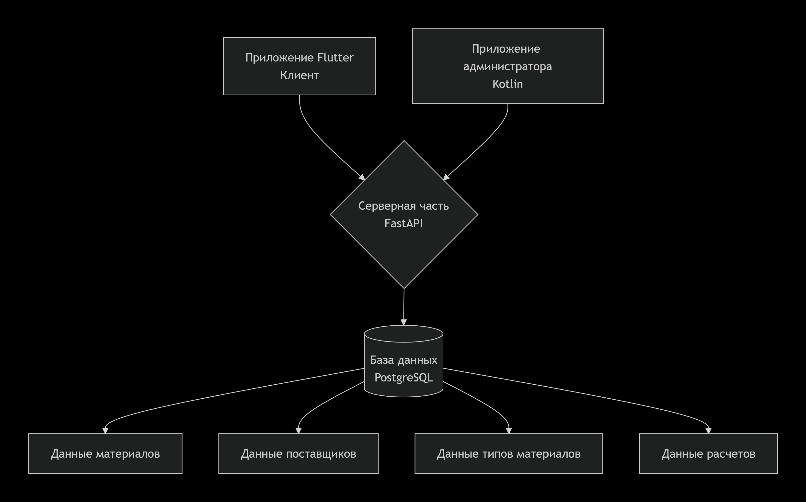
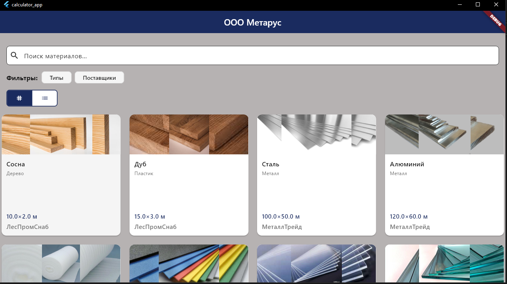
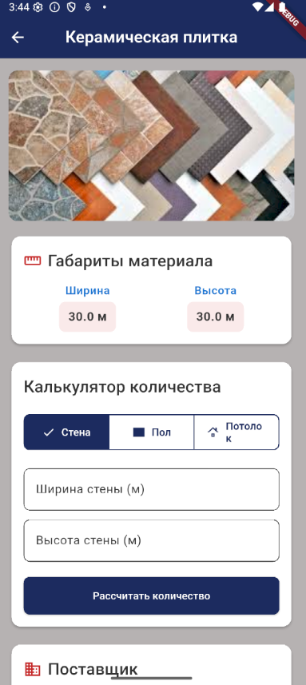
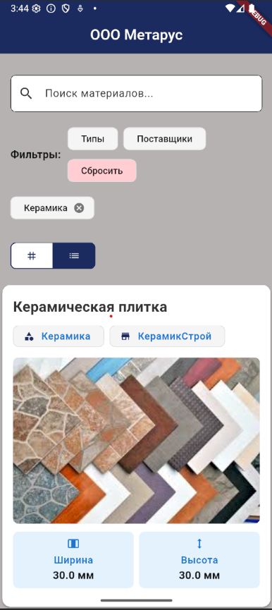
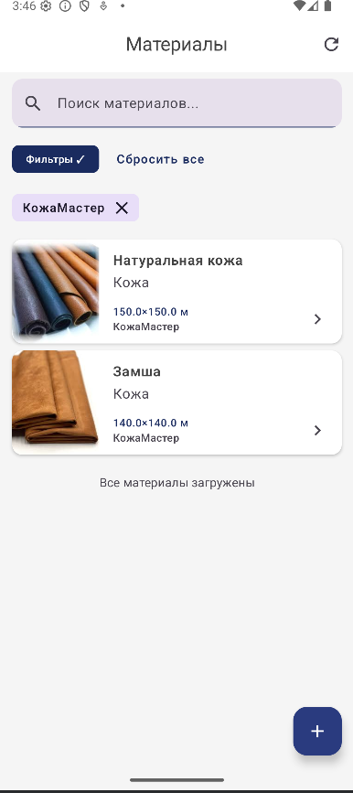
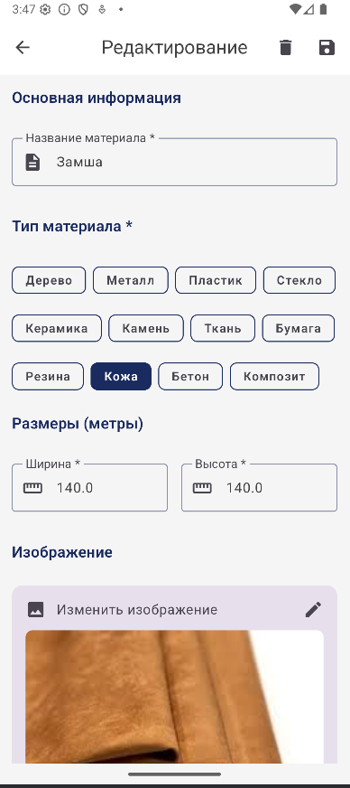
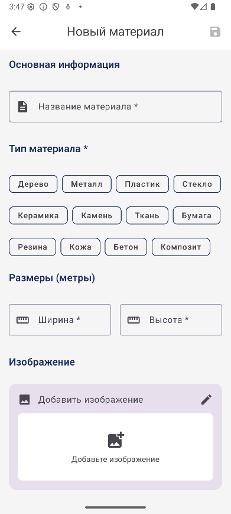
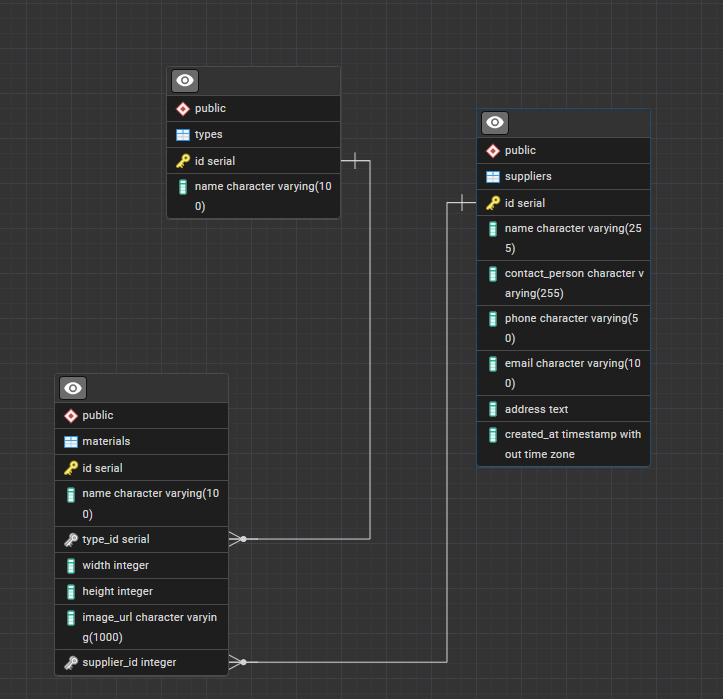

## Обзор проекта

**Metarus Story App** — это комплексное решение для расчета строительных материалов, состоящее из трех взаимосвязанных компонентов:

- **Основное приложение (Flutter)** — кроссплатформенный калькулятор для расчета необходимого количества материалов для стен, пола и потолка
- **Приложение администратора (Android/Kotlin)** — инструмент управления базой материалов, поставщиками и типами материалов
- **Серверная часть (Python/FastAPI)** — REST API сервер с подключением к PostgreSQL для хранения всех данных

**Основная цель проекта** — упростить процесс подсчета строительных материалов, минимизировать ошибки в расчетах и оптимизировать закупки.

---

## Архитектура системы



**Ключевые особенности архитектуры:**
- **REST API** — единый интерфейс для обоих клиентских приложений
- **Единая база данных** — согласованность данных между приложениями
- **Разделение прав доступа** — разный функционал для пользователей и администраторов

---

## Функциональность приложений

### Основное приложение (Flutter)

**Основные функции:**
-  **Расчет материалов** для стен, пола и потолка
- **Динамический каталог** материалов
-  **Фильтрация и поиск** по материалам
- **Пагинация** списка материалов

**Интерфейс и пользовательский опыт:**


*Здесь можно вставить скриншот главного экрана с выбором типа расчета*





---

### Приложение администратора (Kotlin)

**Основные функции:**
- **CRUD операции** с материалами, типами материалов и поставщиками
- **Управление контентом** через интуитивный интерфейс
- **Фильтрация и поиск** с пагинацией
- **Валидация данных** при добавлении/редактировании

**Интерфейс администратора:**







---

## Серверная часть (Python/FastAPI)

**Основные модули и функции:**
- **REST API endpoints** для всех сущностей
- **Работа с PostgreSQL** через асинхронные драйверы
- **Бизнес-логика** расчетов материалов
- **Поддержка фильтрации, поиска и пагинации**

**Примеры API endpoints:**
- `GET /materials/` — список материалов с пагинацией, фильтрацией и поиском
- `PUT /materials/add — создание нового материала
- `GET /materials/{material_id}` — получение конкретного материала
- `PATCH /materials/patch` — обновление материала



---

## Технологический стек

### **Серверная часть**
- **Python 3.9+** — основной язык программирования
- **FastAPI** — современный веб-фреймворк
- **PostgreSQL** — реляционная база данных
- **Pydantic** — валидация данных

### **Основное приложение (Flutter)**
- **Flutter 3.x** — фреймворк для кроссплатформенной разработки
- **Dart** — язык программирования
- **Bloc** — управление состоянием
- **Dio** — HTTP клиент для работы с API
- **GetIt** - управление зависимостями
- **Talker** - для логирования

### **Приложение администратора (Android)**
- **Kotlin** — основной язык программирования
- **Android SDK** — нативная разработка под Android
- **Retrofit** — HTTP клиент для работы с API
- **ViewModel/Flow** — архитектурные компоненты

---

## Установка и запуск

### Предварительные требования
- Python 3.9+
- Flutter 3.x
- Android Studio (для приложения администратора)
- PostgreSQL 12+

### Запуск серверной части
```bash
cd server
pip install -r requirements.txt
uvicorn app.main:app --reload --host 0.0.0.0 --port 8000
```
### Запуск Flutter приложения
```bash
cd calculator_app
flutter pub get
flutter run
```

### Запуск приложения администратора

1. Откройте проект `admin_app` в Android Studio
2. Соберите и запустите на эмуляторе или устройстве